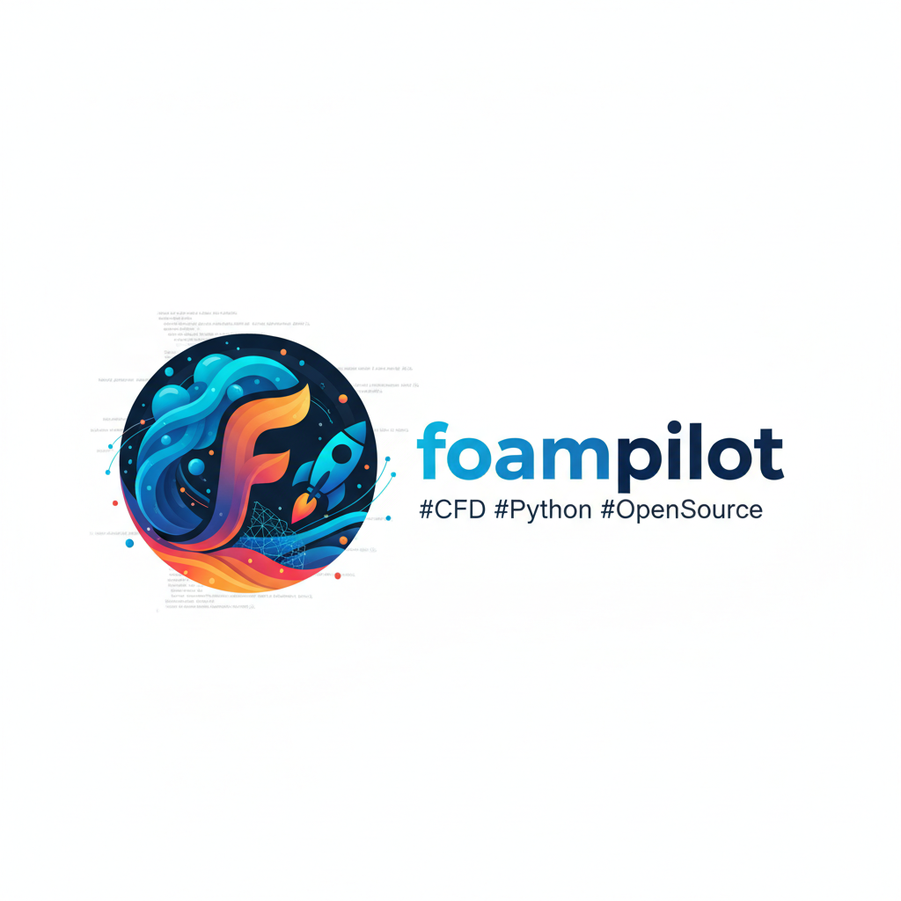

<!-- Logo -->

# foampilot 🚀

🌍 **Languages:**  
[English](README.md) | [Français](README.fr.md) | [中文](README.zh.md)

**foampilot** is a Python platform designed to *fully orchestrate OpenFOAM simulations*  
using Python as the single source of truth — from case definition and meshing to execution,
post-processing, and reporting.

It is intended for engineers and researchers who want **reproducible, scriptable,
and maintainable CFD workflows**, without manually editing OpenFOAM dictionaries.

---

## Motivation

OpenFOAM is extremely powerful, but managing simulations often involves:
- manual editing of multiple dictionary files,
- fragile case duplication,
- ad-hoc scripts for post-processing,
- limited reproducibility across studies.

**foampilot** addresses these issues by placing Python at the center of the workflow:
OpenFOAM cases become *generated artifacts*, not manually maintained inputs.

---

## Key Features

- **Python-first workflow**  
  Define meshes, solvers, boundary conditions, and controls directly in Python.

- **Automatic OpenFOAM case generation**  
  Generate `system`, `constant`, and `0/` files programmatically, consistently, and reproducibly.

- **Mesh orchestration**  
  Native support for `blockMesh` and `snappyHexMesh`, with an extensible architecture.

- **Simulation control**  
  Launch and manage OpenFOAM solvers directly from Python.

- **Modern post-processing**  
  3D visualization with PyVista, automatic export of figures and animations.

- **Automated reporting**  
  Generate PDF calculation notes (LaTeX) or interactive dashboards (Streamlit).

---

## Design Philosophy

- Python is the **source of truth**
- OpenFOAM dictionaries are **generated**, never manually edited
- Reproducibility and traceability over GUI-driven workflows
- Explicit, inspectable configurations
- Designed for automation, parametric studies, and engineering workflows

---

## What foampilot is *not*

- Not a CFD solver  
- Not a replacement for OpenFOAM  
- Not a GUI-based tool  
- Not intended to hide OpenFOAM concepts  

foampilot assumes **basic familiarity with OpenFOAM and CFD**.

---

## Platform Support

- **Linux** (native)
- **Windows via WSL2** (recommended)
- **macOS** (via official OpenFOAM builds)

OpenFOAM installation and system setup are documented separately.

---

## Documentation

📘 Full documentation, including installation guides and detailed usage:

**https://stevendaix.github.io/foampilot/**

The documentation includes:
- OpenFOAM & WSL installation guides
- Project structure and concepts
- Meshing, solver control, and post-processing
- Reporting and visualization workflows

---

## Project Status

⚠️ **Status:** early-stage / beta

The public API may evolve.
Feedback, discussions, and contributions are welcome.

---

## License

This project is released under the **MIT License**.
