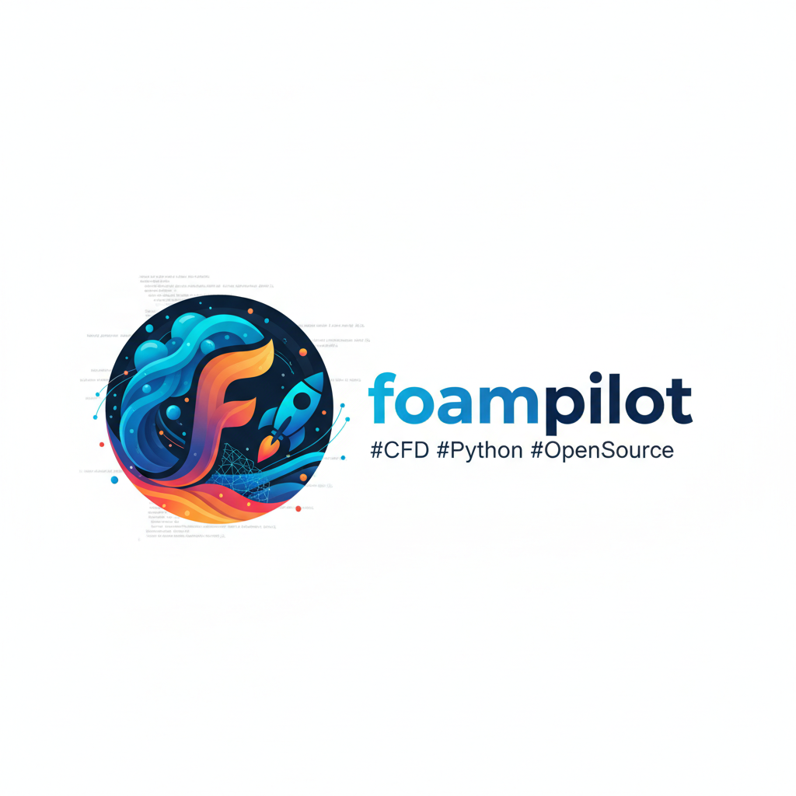

<!-- Logo -->

# foampilot 🚀

🌍 **Languages:**  
[English](README.md) | [Français](README.fr.md) | [中文](README.zh.md)

**foampilot** is a Python platform designed to *fully orchestrate OpenFOAM simulations* — from case definition and meshing to execution,
post-processing, and reporting.

It is intended for engineers and researchers who want **reproducible, scriptable,
and maintainable CFD workflows**, without manually editing OpenFOAM dictionaries.

---

## Motivation

OpenFOAM is extremely powerful, but managing simulations often involves:
- manual editing of multiple dictionary files,
- fragile case duplication,
- ad-hoc scripts for post-processing,
- limited reproducibility across studies.

**foampilot** addresses these issues by placing Python at the center of the workflow:
OpenFOAM cases become *generated artifacts*, not manually maintained inputs.

---

## Key Features

- **Python-first workflow**  
  Define meshes, solvers, boundary conditions, and controls directly in Python.

- **Automatic OpenFOAM case generation**  
  Generate `system`, `constant`, and `0/` files programmatically, consistently, and reproducibly.

- **Mesh orchestration**  
  Support for `blockMesh`, Gmsh, snappyHexMesh, direct OpenFOAM mesh export, and experimental urban geometry/mesh workflows.

- **Simulation control**  
  Launch and manage OpenFOAM solvers directly from Python.

- **Modern post-processing**  
  3D visualisation with PyVista, Plotly-based web presentations, automatic export of figures and animations, wind-analysis helpers, and native OpenFOAM readers. Read single-region and multi-region CHT results **directly** into PyVista without `foamToVTK` via `OpenFOAMDirectReader` and `CHTDirectReader`.

- **Automated reporting**  
  Generate mesh-quality and convergence reports, compare parallel decompositions, create PDF calculation notes with LaTeX or Typst, and build interactive dashboards with Plotly/Streamlit.

---

## Design Philosophy

- OpenFOAM dictionaries are **generated**, never manually edited
- Reproducibility and traceability over GUI-driven workflows
- Explicit, inspectable configurations
- Designed for automation, parametric studies, and engineering workflows

---

## What foampilot is *not*

- Not a CFD solver  
- Not a replacement for OpenFOAM  
- Not a GUI-based tool  
- Not intended to hide OpenFOAM concepts  

foampilot assumes **basic familiarity with OpenFOAM and CFD**.

---

## Platform Support

- **Linux** (native)
- **Windows via WSL2** (recommended)
- **macOS** (via official OpenFOAM builds)

OpenFOAM installation and system setup are documented separately.

---

## Documentation

📘 Full documentation, including installation guides and detailed usage:

**https://stevendaix.github.io/foampilot/**

The documentation includes:
- OpenFOAM and WSL installation guides
- Architecture, generated-case validation, and project structure
- The complete examples and tutorials catalogue
- Meshing strategies, mesh-quality checks, and geometry-specific cases
- Solver control, boundary conditions, and CSV-driven inputs
- Native OpenFOAM reading, PyVista/Plotly visualisation, residual analysis, and reporting
- Detailed CHT data setup, interfaces, execution, and thermal-balance validation
- Applied theory for biomedical flow, outdoor wind, atmospheric boundary layers, and thermoregulation
- CHT, urban CFD, weather, physiological, and geometry-conversion workflows

### MakeHuman and JOS-3 thermoregulation

The repository includes a reproducible MakeHuman-to-STL workflow for thermoregulation experiments. It exports the MakeHuman body through the local socket API, filters the main skin group, and generates 17 JOS-3 surface patches plus a `zone_mapping.csv` for later CFD coupling. See [`examples/thermoregulation/makehuman/README.md`](examples/thermoregulation/makehuman/README.md) for Ubuntu installation, socket configuration, export, zoning, and validation steps.

---

## Project Status

⚠️ **Status:** early-stage / beta

The public API may evolve.
Feedback, discussions, and contributions are welcome.

---

## License

This project is released under the **MIT License**.
