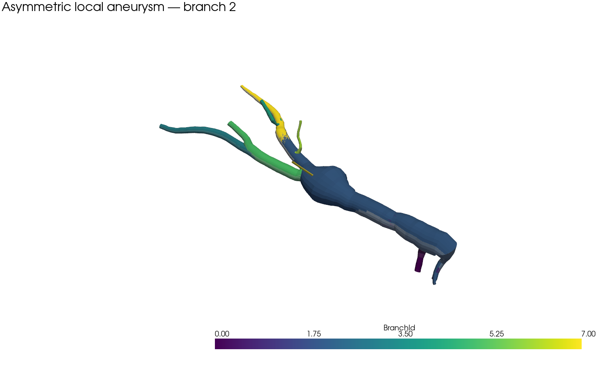

# Exemple 2 — Anévrisme asymétrique local

## Objectif

Cet exemple ajoute un scénario de déformation localisée sans modifier le cas de référence ni le comportement par défaut du package. Il applique la méthode `LocalDeformationSpec` à la branche 2 du cas complexe, puis ajoute une modulation angulaire locale pour produire un anévrisme asymétrique plutôt qu’une simple dilatation concentrique.

> La référence est construite une première fois, puis copiée profondément par `apply_local_deformation`. L’exemple ne modifie jamais les données de référence.

## Exécution

Depuis la racine du dépôt :

```bash
PYTHONPATH=foampilot/src python3 examples/medical_build/example_asymmetric_aneurysm.py
```

Les fichiers sont écrits dans :

```text
examples/medical_build/outputs/asymmetric_aneurysm_example/
```

| Fichier | Rôle |
|---|---|
| `reference_analysis.json` | analyse de référence non déformée |
| `deformed_analysis.json` | analyse déformée |
| `deformation_report.json` | paramètres et statistiques de déformation |
| `asymmetric_aneurysm_sections.vtp` | surface diagnostique déformée |
| `asymmetric_aneurysm_sections.stl` | export STL diagnostique |
| `asymmetric_aneurysm_before_after.png` | comparaison visuelle |

## Paramètres utilisés

```python
LocalDeformationSpec(
    branch_ids=(2,),
    center_abscissa=142.7391175830865,
    sigma=12.0,
    amplitude=0.85,
    junction_protection=8.0,
    max_scale=2.0,
)
```

La déformation radiale est gaussienne le long de l’abscisse de la branche. `junction_protection=8.0` réduit progressivement la déformation aux extrémités de la branche afin de ne pas modifier directement les zones de jonction. Une modulation angulaire d’amplitude `0.28` est ensuite appliquée dans l’exemple uniquement, avec une direction `0.45` radian. Elle augmente davantage un côté de la section et crée l’asymétrie du sac.

## Résultat exécuté

| Mesure | Résultat |
|---|---:|
| Branches analysées | 8 |
| Sections totales | 432 |
| Branche déformée | 2 uniquement |
| Échelle minimale | 1,0 |
| Échelle maximale | 1,85 |
| Échelle moyenne | 1,01486 |
| Points VTP diagnostiques | 20 352 |
| Cellules VTP diagnostiques | 10 176 |



La couleur identifie les branches. Le sac dilaté et asymétrique se situe sur la branche 2 ; les autres branches conservent leur géométrie de référence.

## Limites de l’export

Le STL produit par cet exemple est un **STL diagnostique de sections raccordées**. Il sert à vérifier la déformation et son extension spatiale. Il ne remplace pas le STL multi-régions validé pour `snappyHexMesh`, car la jonction centrale et les caps CFD doivent être reconstruits par le backend géométrique complet avant usage en simulation.

Pour un cas OpenFOAM déformé, la procédure correcte est :

```text
analyse de référence
→ copie déformée
→ reconstruction globale avec caps et patches
→ contrôle surfaceCheck
→ snappyHexMesh
→ checkMesh
```

La déformation n’est jamais appliquée au cas de référence par défaut. `apply_local_deformation(analysis, None)` reste un no-op et les tests de non-régression doivent rester positifs.

## Références

[1]: https://github.com/jacobo-diaz/aneupy "AneuPy — référence méthodologique"

[2]: https://arxiv.org/html/2504.15285v1 "Méthode de modélisation d’anévrisme utilisée comme référence"
