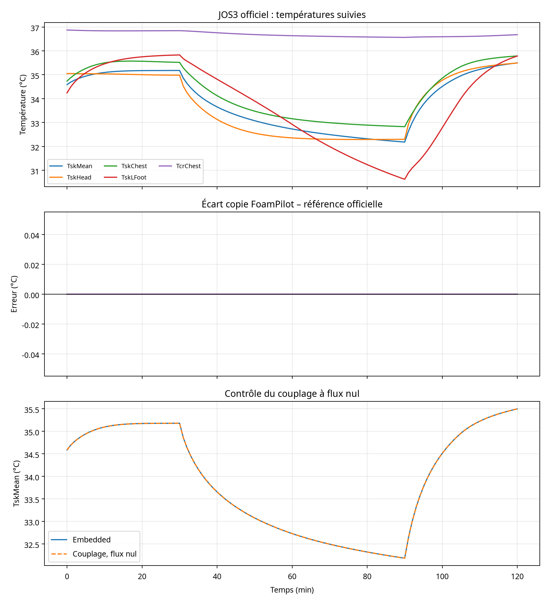

# Post-traitement des résultats JOS3 et OpenFOAM 13

## Périmètre

Le post-traitement porte sur les résultats réellement générés par la comparaison entre l’implémentation FoamPilot et la référence officielle JOS3, ainsi que sur les deux cas OpenFOAM 13 exécutés pendant la validation : `buoyantCavity` et `coolingSphere`. Les données JOS3 contiennent **121 échantillons**, couvrant **0 à 120 minutes**.

## Comparaison avec la référence JOS3

Les cinq signaux suivis — température cutanée moyenne, tête, thorax, pied gauche et température centrale du thorax — sont identiques dans le fichier de comparaison disponible, à la précision flottante près. Le contrôle du couplage à flux nul produit également la même température cutanée moyenne que le modèle embarqué.

| Signal | Erreur absolue maximale | Erreur absolue moyenne | RMSE | Erreur finale |
|---|---:|---:|---:|---:|
| `TskMean` | 0 °C | 0 °C | 0 °C | 0 °C |
| `TskHead` | 0 °C | 0 °C | 0 °C | 0 °C |
| `TskChest` | 0 °C | 0 °C | 0 °C | 0 °C |
| `TskLFoot` | 0 °C | 0 °C | 0 °C | 0 °C |
| `TcrChest` | 0 °C | 0 °C | 0 °C | 0 °C |
| `coupled_zero_flux_TskMean` | 0 °C | 0 °C | 0 °C | 0 °C |

La courbe d’erreur est donc confondue avec zéro sur l’échelle du graphique. Cette observation confirme que le durcissement des contrats, la correction des interfaces et l’ajout de la normalisation des unités n’ont pas introduit de dérive dans le scénario nominal. Une exécution en haute précision a également fourni des écarts de l’ordre de `10⁻¹³ °C`, compatibles avec l’arrondi numérique.

La dynamique thermique montre trois phases : une stabilisation initiale proche de la thermoneutralité, un refroidissement après le changement d’environnement autour de 30 minutes, puis une remontée lors du retour à une condition plus chaude autour de 90 minutes. La température centrale du thorax reste beaucoup plus stable que les températures cutanées, ce qui est cohérent avec la régulation thermique du modèle.

## Résultats OpenFOAM 13

| Cas | Nombre de répertoires temporels observés | Temps final | Présence de logs | Interprétation |
|---|---:|---:|---|---|
| `buoyantCavity_validation` | 4 | 1000 | Oui | Cas de convection naturelle terminé avec succès |
| `coolingSphere_validation` | 21 | 1 | Oui | Cas CHT transitoire multi-région terminé avec succès |

Ces deux calculs valident l’installation et l’exécution du moteur OpenFOAM 13 ainsi que des chaînes de calcul de convection naturelle et de transfert conjugué. Ils ne valident pas à eux seuls la physiologie humaine ni le couplage expérimental avec un corps humain maillé.

## Conclusion technique

Les résultats post-traités démontrent trois améliorations. Premièrement, les corrections d’API et de calcul restent compatibles avec la référence JOS3. Deuxièmement, le chemin de couplage à flux nul est neutre, ce qui constitue un test de non-régression important. Troisièmement, l’environnement OpenFOAM 13 exécute correctement les cas de référence du dépôt.

La prochaine étape scientifique devrait être une validation couplée non nulle, avec comparaison des flux surfaciques, des températures d’air et des températures de surface sur un cas CFD transitoire reproductible. La validation du rayonnement solaire dédié et une validation expérimentale humaine restent également à traiter séparément.

## Artefacts

Les métriques machine-readable sont disponibles dans `postprocess_summary.json` et `jos3_metrics_postprocess.csv`. Le graphique est disponible dans `jos3_comparison_postprocess.png`. Le traitement complet est reproductible avec `python3 tools_postprocess_physiology.py` depuis la racine du dépôt.
